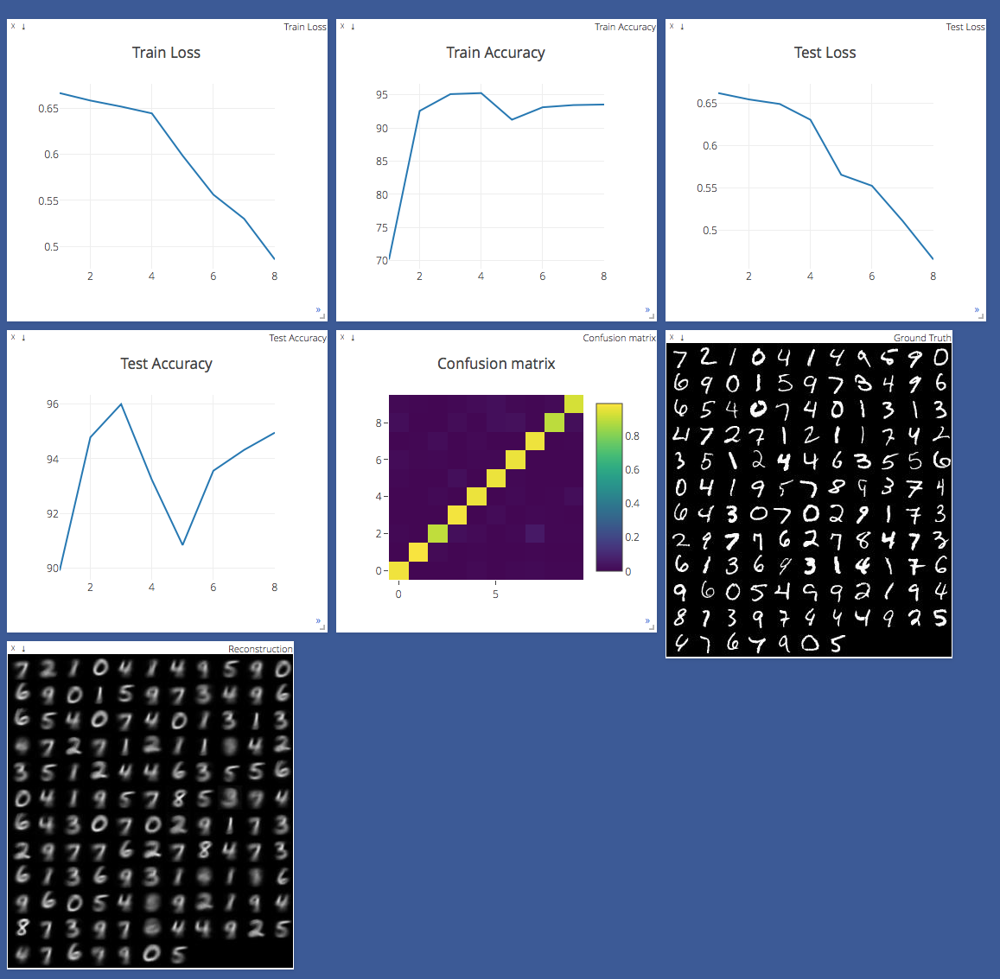

# Dynamic Routing Between Capsules

This ia a barebone CUDA-enabled Torch / PyTorch with Facebook's Visdom Server implementation of the CapsNet architecture in the paper "Dynamic Routing Between Capsules" by [Kenta Iwasaki](https://github.com/iwasaki-kenta) on behalf of Gram.AI.

Download Torchnet (you can do it via your Jupyter notebook) as the training for the model is done using [TorchNet](https://github.com/pytorch/tnt), with MNIST dataset loading and preprocessing done with [TorchVision](https://github.com/pytorch/vision).

## Description

> A capsule is a group of neurons whose activity vector represents the instantiation parameters of a specific type of entity such as an object or object part. We use the length of the activity vector to represent the probability that the entity exists and its orientation to represent the instantiation paramters. Active capsules at one level make predictions, via transformation matrices, for the instantiation parameters of higher-level capsules. When multiple predictions agree, a higher level capsule becomes active. We show that a discrimininatively trained, multi-layer capsule system achieves state-of-the-art performance on MNIST and is considerably better than a convolutional net at recognizing highly overlapping digits. To achieve these results we use an iterative routing-by-agreement mechanism: A lower-level capsule prefers to send its output to higher level capsules whose activity vectors have a big scalar product with the prediction coming from the lower-level capsule.

**Routing Algorithm**


**Margin Loss for Digita Existence**

<a href="https://www.codecogs.com/eqnedit.php?latex=L_c&space;=&space;T_c&space;max(0,&space;m^&plus;&space;-&space;||v_c||)^2&space;&plus;&space;\lambda&space;(1&space;-&space;T_c)&space;max(0,&space;||v_c||&space;-&space;m^-)^2" target="_blank"></a>

**Architechture Layer**

A 3-layer CapsNet architecture.


**Decoder Layer**


Paper written by Sara Sabour, Nicholas Frosst, and Geoffrey E. Hinton. For more information, please check out the paper [here](https://arxiv.org/abs/1710.09829).

__Note__: Affine-transformations for the data augmentation stage have not been implemented yet. This implementation only provides an efficient implementation for the dynamic routing procedure, example CapsNet architecture, and squashing functions mentioned in the paper.

## Requirements

* Python 3 (Mine is 3.6.x distro)
* PyTorch
* TorchVision
* TorchNet (Download it via your Jupyter Notebook, easy peasy :))
* TQDM (for checking out the progress)
* Visdom (Neat visualization of your train, acuracy and margin losses)

## Usage

**Step 1** Adjust the "hyperparamters" in the cell block and play with the results such as number of training epochs, batch sizes, etc. inside `capsule_network.py`.

```python
batch_size = 128
num_classes = 10
num_epochs = 100
num_rout_iter = 3 (Number of routing iterations)
```
I will bwe adding other hyperparameters such as learning rate and see if this helps improve the results

Follow the simple instructions in this Jupyter Notebook.

## Benchmarks

Highest accuracy was [**coming soon as I'm still running it**] after 100 epochs. This image is after just 8 epochs, we're doing 100 now. We will go for 1000 later and see if it improves.



Default PyTorch Adam optimizer hyperparameters were used with no learning rate scheduling. Epochs with batch size of 128 is taking me approximately  takes ~2.85 interations per minute OR approx. ~ 2.5 mins per epoch on an Ubuntu 16.04 Server with 64Gig Ram and 8 Gig GTX 1080 GPU. 

## TODO

* Extension to other datasets apart from MNIST.
* CIFAR10 and other datasets
* Images larger that the MNIST and CIFAR
* Video files

## Credits & Sources

Primarily referenced these two TensorFlow and Keras implementations:
1. [Keras implementation by @XifengGuo](https://github.com/XifengGuo/CapsNet-Keras)
2. [TensorFlow implementation by @naturomics](https://github.com/naturomics/CapsNet-Tensorflow)
3. [Kenta Iwasaki for making this PyTorch implementation](https://github.com/iwasaki-kenta)

Also worthwhile following a bunch of discussions here such as this: [@InnerPeace-Wu](https://github.com/InnerPeace-Wu) for a [discussion on the dynamic routing procedure](https://github.com/XifengGuo/CapsNet-Keras/issues/1) outlined in the paper.

**NOTE**: I will be rolling all these up to the main README.md file for the CapsNets detailing about what I learned from all the three implementations of Keras, PyTorch and Tensorflow. so stay tuned!
## Contact

I am testing a whole lot of new and upcoming AI and Data Models. Feel free to reach out to me if you need help or suggestions.
Here is my contact detail at [LinkedIn](https://www.linkedin.com/in/tarrysingh/), [Quora](https://www.quora.com/profile/Tarry-Singh) , My Website(https://tarrysingh.com) or simply [email](tarry.singh@gmail.com)
